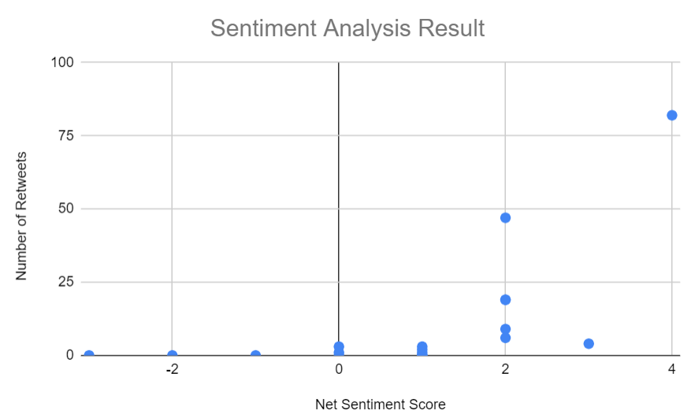

# Twitter-Sentiment-Analysis
The hands-on project is in Python 3 Programming class offered by University of Michigan via Coursera. 

### The task is to build a sentiment classifier, which will detect how positive or negative each tweet is. 
I create a csv file, which contains columns for the Number of Retweets, Number of Replies, Positive Score (which is how many happy words are in the tweet), Negative Score (which is how many angry words are in the tweet), and the Net Score for each tweet. At the end, I upload the csv file to Excel or Google Sheets, and produce a graph of the Net Score vs Number of Retweets.

#### The graph is created in Google Sheets
According to the result, the more positive the posts appear to be, the more number of retweets the posts receive.

